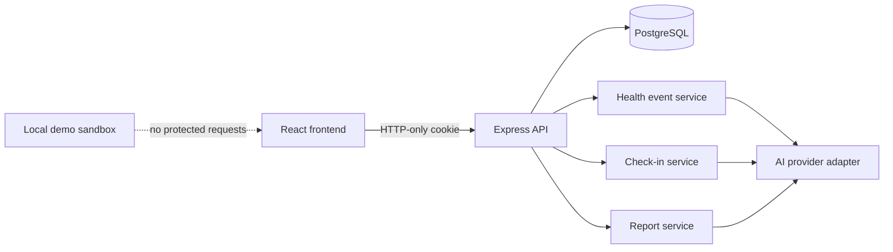
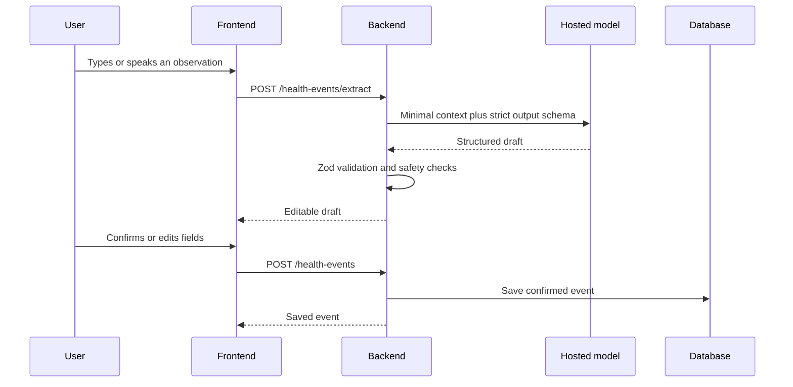

# Butta Health Backend Integration Plan

## Product Goal

Turn the current frontend prototype into a credible end-to-end health journaling
product. Registered users use the secured API and database. Demo users use an
isolated browser-only sandbox containing synthetic data. AI organizes user-entered
information but never diagnoses, prescribes, or saves unconfirmed extraction.

## System Map



## Data Ownership

| Mode | Identity | Health data | Persistence |
| --- | --- | --- | --- |
| Registered user | Backend cookie session | PostgreSQL, scoped by authenticated user ID | Cross-device |
| Demo | Local demo-mode marker, not authentication | Synthetic records only | Browser localStorage |

Rules:

- Never put passwords, JWTs, session cookies, or real health data in localStorage.
- Never accept `userId` from health-data request bodies or query strings.
- Seed demo records only after the user explicitly enters demo mode.
- Namespace and version demo keys, for example `butta:demo:events:v1`.
- Provide a reset action that deletes only demo keys.

## Core Database Models

### HealthEvent

- `id`, `userId`
- `type`: symptom, medication, digestive, doctor visit, check-in
- `title`, `occurredAt`, `severity`
- `symptoms[]`, `treatment`, `notes`
- `source`: typed, voice, preset
- `status`: confirmed, needs monitoring, prepared
- `createdAt`, `updatedAt`

### AiExtraction

- `id`, `userId`, optional `healthEventId`
- `model`, `provider`, `promptVersion`
- `rawInput`, `structuredOutput`
- `status`, `createdAt`

### CheckIn

- `id`, `userId`, `promptType`, `promptText`
- `scheduledFor`, optional `respondedAt`
- optional linked `healthEventId`

### DoctorReport

- `id`, `userId`, reporting period
- selected event references
- structured report JSON
- model and prompt version
- generation timestamp and optional PDF location

### NotificationPreference and AiConsent

- Per-user reminder, check-in time, timezone, and summary settings
- Explicit AI-processing consent and policy version

## API Map

### Phase 1: Real Health Events

- `GET /api/health-events`
- `POST /api/health-events`
- `GET /api/health-events/:id`
- `PATCH /api/health-events/:id`
- `DELETE /api/health-events/:id`
- `GET /api/dashboard`

List filters: `type`, `severity`, `status`, `from`, `to`, `search`, `limit`,
and `cursor`. Search and all aggregates remain scoped to the cookie owner.

### Phase 2: AI-Assisted Capture

- `POST /api/health-events/extract`
- Input: plain-language observation and source
- Output: strict structured draft plus safety metadata
- The frontend shows an editable confirmation screen.
- Only `POST /api/health-events` persists the confirmed draft.

### Phase 3: Interactive Check-ins

- `GET /api/check-ins/today`
- `POST /api/check-ins/:id/respond`
- `GET /api/check-ins/history`

Prompt selection starts with deterministic rules. AI may improve wording but does
not decide urgency or provide a diagnosis.

### Phase 4: Visit Briefs

- `POST /api/doctor-reports`
- `GET /api/doctor-reports/:id`
- `GET /api/doctor-reports/:id/pdf`

The generated artifact is named **Patient-Generated Visit Brief**. It is not
presented as a clinician-authored or clinician-attested report.

## AI Processing Flow



Use a provider-neutral interface:

```ts
interface HealthAiProvider {
  extractObservation(input: ExtractionInput): Promise<ExtractionResult>;
  writeCheckIn(input: CheckInContext): Promise<CheckInDraft>;
  buildVisitBrief(input: ReportContext): Promise<ReportDraft>;
}
```

The first provider can be replaced without changing controllers, database models,
or frontend contracts.

## Visit Brief Structure

1. Patient details and reporting window
2. Patient-stated reason for the visit
3. Chronological symptom timeline
4. Frequency and severity trends calculated by the backend
5. Associated symptoms and reported triggers
6. Medication and reported response
7. Allergies and existing conditions
8. Questions the patient wants to discuss
9. Source event IDs and generation metadata
10. Non-diagnostic, patient-generated notice

The model returns structured sections and `sourceEventIds`. The backend rejects
unknown IDs, calculates counts itself, and renders HTML/PDF from a fixed template.

## Safety and Privacy Controls

- AI output is assistive and non-diagnostic.
- Medication changes and treatment recommendations are prohibited.
- Urgent symptom handling uses curated server rules in addition to model output.
- Store prompt version, model, provider, timestamps, and source-event references.
- Send the minimum required data to the model and omit direct identifiers.
- Require explicit consent before external AI processing.
- Rate-limit AI endpoints separately and enforce request-size limits.
- Never log raw health notes or model payloads in application logs.

## Delivery Plan

### Milestone 1: Persistent product core

- [x] Add HealthEvent Prisma model and migration
- [x] Add authenticated event CRUD
- [x] Add filtering, pagination, ownership checks, and validation
- [x] Add event tests and OpenAPI documentation
- [x] Connect registered frontend users to event endpoints
- [x] Isolate the local demo sandbox

Implementation status, September 15, 2026: Milestone 1 is complete in code.
Database-free tests, frontend lint, and frontend/backend builds pass. The event
integration suite is written and typechecked; run it after configuring a separate
`TEST_DATABASE_URL` because this checkout currently has no local `.env`.

### Milestone 2: Dashboard and prompts

- [x] Add a dashboard aggregation endpoint
- [x] Replace frontend-derived production metrics
- [x] Add deterministic daily check-in generation
- [x] Persist check-in responses as confirmed events
- [x] Add notification preferences

Implementation status, September 15, 2026: Milestone 2 is complete in code.
Dashboard periods use explicit IANA timezones, daily prompts are stable per local
date, and responses create linked `CHECK_IN` events in one transaction. Preference
records are created with accounts and store intent only; notification delivery is
outside this milestone. The database integration suite still requires the isolated
`TEST_DATABASE_URL` described above.

### Milestone 3: Provider-independent AI

- [ ] Add the HealthAiProvider contract
- [ ] Add strict extraction schemas and provider adapter
- [ ] Add consent, rate limits, timeout, retry, and refusal handling
- [ ] Add extraction fixtures and evaluation cases
- [ ] Preserve a deterministic non-AI capture fallback

### Milestone 4: Visit brief

- [ ] Add selected-event report generation
- [ ] Validate every claim against source events
- [ ] Render a stable HTML and PDF template
- [ ] Add report history and immutable snapshots
- [ ] Evaluate optional FHIR export separately

## Interview Demonstration

The strongest end-to-end story is:

1. Register and complete a private profile.
2. Enter a natural-language observation.
3. Review the structured extraction before saving.
4. See the real database-backed dashboard and timeline update.
5. Answer a contextual follow-up prompt.
6. Select events and generate a patient visit brief with source references.
7. Switch to demo mode and show that its data remains browser-only.

## External References

- OpenAI Structured Outputs: https://openai.com/index/introducing-structured-outputs-in-the-api/
- OpenAI API data controls: https://platform.openai.com/docs/models/default-usage-policies-by-endpoint
- HL7 FHIR Composition: https://hl7.org/fhir/R5/composition.html
- FDA Clinical Decision Support guidance: https://www.fda.gov/regulatory-information/search-fda-guidance-documents/clinical-decision-support-software
