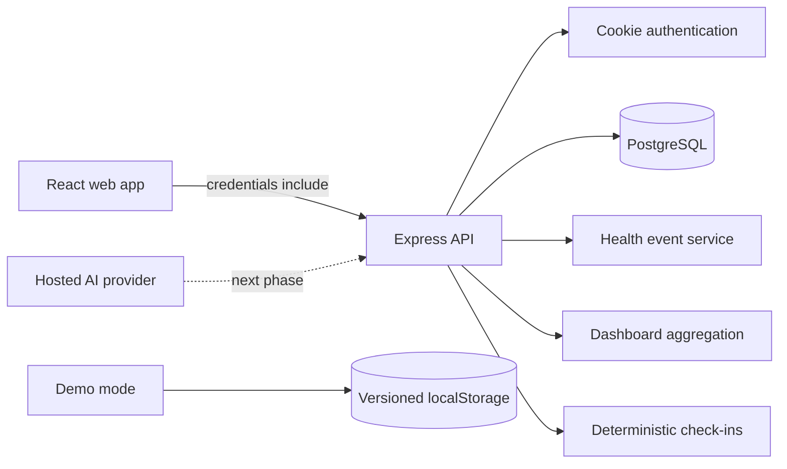

# Butta Health Master Project Context

Last updated: September 15, 2026

This is the primary handoff document for continuing Butta Health in another
workspace or coding session. Read this file first, then read
`docs/BACKEND_INTEGRATION_PLAN.md` for the detailed backend roadmap.

## Resume Here

The polished frontend, persistent health-event core, backend dashboard, daily
check-ins, and notification preferences are implemented.

There are two different numbering systems in earlier planning:

- Delivery **Milestones 1 and 2 are complete**.
- The next backend feature is **API Phase 2: AI-assisted capture**.

Do not rebuild the dashboard or deterministic check-in foundation. The next
engineer should start by adding a provider-independent AI boundary and a safe
structured extraction endpoint while preserving the current deterministic parser
as a fallback.

## Product Goal

Butta Health is a private health-journaling product that helps people record small
changes in how they feel, organize those observations into a longitudinal history,
and prepare a concise patient-generated brief for a medical appointment.

The product should:

1. Make daily health logging quick and approachable.
2. Turn natural-language observations into editable structured drafts.
3. Preserve a clear timeline of symptoms, medications, digestive events, visits,
   and check-ins.
4. Surface factual trends without diagnosing or prescribing.
5. Produce a source-linked **Patient-Generated Visit Brief** for discussion with a
   clinician.
6. Keep registered-user data private and server-owned while providing a separate
   synthetic browser-only demo.

## Product Boundaries

- AI is assistive, non-diagnostic, and never saves an extraction without user
  confirmation.
- Urgent-symptom rules must be curated server logic, not model judgment alone.
- The visit artifact is patient-generated, not clinician-authored or attested.
- Real passwords, tokens, sessions, and health records must never be stored in
  localStorage.
- The API derives identity exclusively from the authenticated HTTP-only cookie.
- Health-data payloads must never accept a client-controlled `userId`.

## Repositories And Branches

### Web application

- Local path: `C:\WebPhoenix\personal\butta-health`
- GitHub: `https://github.com/JerahmeelN806/butta-health`
- Active continuation branch: `build`
- Current pushed commit: `7a16e993313c0fc7c875f6d8adc0a7e65dd49318`
- `main` remains at the earlier prototype commit.

### Backend API

- Local path: `C:\WebPhoenix\personal\butta-health-backend`
- GitHub: `https://github.com/Cybug-dev/butta-health-backend`
- Active continuation branch: `build`
- Current pushed commit: `a892963dffc9a24a4e06d9524209fe9a48b4fcea`
- `main` remains at the earlier authentication/profile foundation.

Both repositories matched `origin/build` before this handoff document was added.
The frontend now has this document as its only uncommitted file; the backend
working tree remains clean.

## Technology Stack

### Frontend

- React 18 and TypeScript
- Vite 6
- Tailwind CSS 3
- GSAP 3 for entrance and route transitions
- Lucide React icons
- Browser History API routing inside the current single-page application

### Backend

- Node.js 24 and TypeScript ESM
- Express 5
- Prisma 7 with PostgreSQL/Neon
- Zod 4 request validation
- Argon2id passwords
- JOSE JWTs in HTTP-only cookies
- Helmet, credentialed CORS, request limits, and auth rate limiting
- Swagger UI and OpenAPI 3.0.3

## Current Architecture



Registered mode and demo mode are deliberately separate:

| Mode | Identity | Health data | Persistence |
| --- | --- | --- | --- |
| Registered | Backend HTTP-only cookie | PostgreSQL, owner-scoped | Cross-device |
| Demo | Local demo marker only | Synthetic records | Browser localStorage |

## Frontend Status

### Implemented public experience

- Image-led responsive home page with a fixed, scroll-reactive header.
- GSAP left/right entrance motion and route transitions.
- Sign-in and create-account screens.
- Two-step profile onboarding.
- Real registration, sign-in, session restoration, profile save, and sign-out.
- Local demo entry that never calls protected health-data endpoints.

Public routes:

- `/`
- `/signin`
- `/signup`
- `/onboarding`

### Implemented application workspace

- Fixed desktop navigation and responsive mobile navigation.
- Fixed dashboard insight rail with wellness illustration assets.
- Backend-driven metrics for registered users.
- Searchable and filterable health-event timeline.
- Natural-language event capture and editable confirmation modal.
- Health profile editor.
- Interactive daily check-in card.
- Persisted notification preference controls.
- Doctor-preparation selection and a frontend-only summary preview.
- Loading, empty, overflow, badge, and recoverable error states.

Workspace routes:

- `/app/dashboard`
- `/app/profile`
- `/app/log-event`
- `/app/history`
- `/app/settings`
- `/app/companion`
- `/app/doctor-prep`
- `/app/doctor-summary`

### Frontend data boundary

`src/services/api.ts` contains the registered-user API client. Every request uses
`credentials: "include"`.

`src/services/mockApi.ts` is demo-only. Demo keys are centralized in
`src/services/demoStorage.ts`:

- `butta:demo:session:v1`
- `butta:demo:events:v1`
- `butta:demo:profile:v1`
- `butta:demo:check-in:v1`
- `butta:demo:preferences:v1`

The demo reset action deletes only those keys.

### Important frontend limitation

Natural-language parsing currently uses the deterministic local
`parseObservation` function. It provides a credible fallback and confirmation UX,
but it is not AI. The doctor summary is also currently generated from frontend
records rather than a persisted backend report.

## Backend Status

### Authentication and profile

Implemented:

- Native email/password registration and login.
- Argon2id password hashing.
- Signed, expiring JWT session in an HTTP-only cookie.
- Session restoration through `GET /api/auth/me`.
- Logout and cookie clearing.
- Owner-scoped health-profile read and replacement.
- Registration/login rate limits and generic credential failures.

### Persistent health events

Implemented:

- `HealthEvent` Prisma model and migration.
- Types: `SYMPTOM`, `MEDICATION`, `DIGESTIVE`, `DOCTOR_VISIT`, `CHECK_IN`.
- Authenticated create, read, update, delete, filtering, search, and cursor
  pagination.
- Ownership checks on every operation.
- Strict Zod validation and database constraints.
- `CHECK_IN` creation is reserved for the check-in response flow.
- Linked check-in event types cannot be changed.
- Deleting a linked check-in event atomically reopens that daily prompt.

### Dashboard and check-ins

Implemented:

- One owner-scoped dashboard snapshot endpoint.
- Profile completion, total events, monthly count, watch count, symptom count,
  recent events, latest event, and seven-day activity.
- IANA-timezone-aware date boundaries, including DST handling.
- One deterministic check-in prompt per user and local date.
- Prompt selection for first entry, daily reflection, recent symptom follow-up,
  and recent medication follow-up.
- Atomic response claiming, confirmed `CHECK_IN` event creation, and linking.
- Duplicate-response protection.
- Check-in history.

### Notification preferences

Implemented:

- One preference row per user.
- Event reminder, weekly summary, and daily check-in flags.
- Local check-in time and IANA timezone.
- Defaults created with registration and migration backfill for existing users.

These settings currently store user intent. There is no scheduler, email service,
push provider, or delivery worker yet.

## Current API Surface

### Public and authentication

- `GET /api/health`
- `POST /api/auth/register`
- `POST /api/auth/login`
- `GET /api/auth/me`
- `POST /api/auth/logout`

### Profile and events

- `GET /api/health-profile`
- `PUT /api/health-profile`
- `GET /api/health-events`
- `POST /api/health-events`
- `GET /api/health-events/:id`
- `PATCH /api/health-events/:id`
- `DELETE /api/health-events/:id`

Event list filters: `type`, `severity`, `status`, `from`, `to`, `search`,
`limit`, and `cursor`.

### Dashboard, check-ins, and preferences

- `GET /api/dashboard?timezone=Africa%2FLagos`
- `GET /api/check-ins/today?timezone=Africa%2FLagos`
- `POST /api/check-ins/:id/respond`
- `GET /api/check-ins/history`
- `GET /api/notification-preferences`
- `PUT /api/notification-preferences`

### API documentation

- Swagger UI: `/api-docs/`
- OpenAPI JSON: `/api-docs/openapi.json`

Swagger is intentionally read-only. Use Postman or the frontend for authenticated
writes so the trusted-origin and cookie behavior remain explicit.

## Database Models Present

- `User`
- `AuthAccount`
- `HealthProfile`
- `HealthEvent`
- `CheckIn`
- `NotificationPreference`

Planned but not implemented:

- `AiExtraction`
- `AiConsent`
- `DoctorReport`
- Optional notification delivery/job records

## Security And Privacy Decisions

- Production identity comes only from the HTTP-only cookie.
- JWTs and passwords are never returned to the frontend.
- Protected responses use `Cache-Control: no-store`.
- Browser writes require the configured frontend origin.
- JSON write bodies are limited to 100 KB.
- Unknown input fields are rejected.
- Database relations cascade from user ownership.
- AI endpoints must receive separate rate limits and explicit consent.
- Raw health notes and model payloads must not be written to application logs.
- Only the minimum necessary context should be sent to an external model.

## Verification At Handoff

Frontend checks passed:

```powershell
pnpm lint
pnpm build
```

Backend checks passed:

```powershell
npm run prisma:validate
npm run prisma:generate
npm run typecheck
npm run build
```

Eighteen database-free backend tests passed, covering bootstrap/security headers,
OpenAPI routes, schemas, timezone boundaries, and validation.

Database integration suites are written for auth, profile, health events,
dashboard, check-ins, preferences, ownership, pagination, and atomic response
behavior. They were not executed at handoff because this checkout has no `.env`
or `TEST_DATABASE_URL`.

## Environment And Local Setup

### Frontend

Optional `.env.local`:

```dotenv
VITE_API_BASE_URL=http://localhost:5000/api
```

Commands:

```powershell
pnpm install
pnpm dev
```

### Backend

Create `.env` from `.env.example` and supply:

```dotenv
NODE_ENV=development
PORT=5000
DATABASE_URL=postgresql://...
CLIENT_URL=http://localhost:5173
JWT_SECRET=<64 hexadecimal characters>
JWT_EXPIRES_IN_SECONDS=3600
TEST_DATABASE_URL=postgresql://...separate-disposable-database...
```

`TEST_DATABASE_URL` must never point to the application database. Tests explicitly
reject matching database identities.

Commands:

```powershell
npm ci
npm run prisma:generate
npm run prisma:migrate
npm run db:check
npm test
npm run dev
```

Use `prisma migrate deploy` through `npm run prisma:migrate`. Do not use
`prisma migrate reset`, `migrate dev`, or `db push` against production.

## What Comes Next

### Immediate: backend API Phase 2, AI-assisted capture

1. Add the provider-neutral `HealthAiProvider` contract.
2. Add `AiConsent` and `AiExtraction` models and migrations.
3. Define strict Zod schemas for model input and structured output.
4. Implement `POST /api/health-events/extract`.
5. Add one hosted-model adapter after the provider is selected.
6. Add timeout, refusal, malformed-output, and provider-unavailable handling.
7. Add separate AI rate limits and request-size limits.
8. Add deterministic server-side urgent-symptom rules.
9. Store provider, model, prompt version, status, timestamps, and the minimal raw
   input required for auditability.
10. Return an editable draft only. Continue using `POST /api/health-events` as the
    sole persistence step after user confirmation.
11. Connect the frontend capture screen to the extraction endpoint for registered
    users.
12. Keep `parseObservation` as the demo and non-AI fallback.

Recommended provider interface:

```ts
interface HealthAiProvider {
  extractObservation(input: ExtractionInput): Promise<ExtractionResult>;
  writeCheckIn(input: CheckInContext): Promise<CheckInDraft>;
  buildVisitBrief(input: ReportContext): Promise<ReportDraft>;
}
```

### After AI extraction

1. Optionally let AI improve check-in wording while deterministic backend rules
   remain responsible for prompt category and safety.
2. Add notification delivery only after choosing email/push infrastructure.
3. Implement persisted `DoctorReport` snapshots from selected owned events.
4. Require every generated report claim to reference valid source event IDs.
5. Calculate counts and trends in backend code, not in the model.
6. Render a fixed HTML template and then PDF.
7. Add report history and immutable generation metadata.
8. Evaluate FHIR export separately; do not let it delay the visit-brief workflow.

## Suggested AI Acceptance Criteria

- Valid observations return a schema-valid editable draft.
- The endpoint never creates a `HealthEvent` by itself.
- Unknown model fields are rejected.
- Malformed output falls back cleanly to deterministic capture.
- Provider timeouts do not lose the user's original text.
- No direct identifiers are included in provider payloads.
- Consent is required before external processing.
- Urgent curated phrases return fixed safety metadata without a diagnosis.
- Tests cover ordinary symptoms, medication mentions, negation, uncertainty,
  refusal, timeout, malformed JSON, prompt injection, and repeat submissions.

## Known Gaps And Risks

- No hosted AI provider has been selected or integrated.
- No AI consent record or extraction audit trail exists yet.
- The frontend doctor summary is not a persisted backend report.
- No real PDF export exists.
- Notification settings do not deliver notifications yet.
- Password reset, email verification, refresh tokens, and session revocation are
  not implemented.
- Google OAuth is reserved in the schema but has no flow.
- Auth rate limiting is process-local and needs a shared store before horizontal
  scaling.
- The frontend currently requests up to 100 events for its local timeline. A
  production timeline should expose load-more or cursor pagination controls.
- The isolated PostgreSQL integration suite still needs to be run before a
  production deployment.
- The backend package requires Node `>=24.21.0 <25`; the temporary runtime used
  during implementation was Node 24.19.0, so deployment should use the declared
  version or newer within Node 24.

## Do Not Regress These Decisions

- Do not replace registered-user cookie authentication with localStorage auth.
- Do not let demo mode make protected health-data requests.
- Do not allow AI extraction to save without confirmation.
- Do not accept `userId` from health-data clients.
- Do not let the model calculate authoritative counts or invent source events.
- Do not call the visit brief a doctor-authored or doctor-approved report.
- Do not add diagnosis, medication-change, or treatment-recommendation behavior.
- Do not remove the deterministic fallback when adding a hosted provider.

## Recommended Continuation Order

1. Pull both `build` branches and confirm the hashes listed above.
2. Configure an isolated `TEST_DATABASE_URL` and run the entire backend suite.
3. Deploy the existing migrations to a non-production environment.
4. Select the hosted model and document its data-retention terms.
5. Implement AI consent, provider contract, extraction schema, and fallback.
6. Connect and test the registered-user capture flow end to end.
7. Implement the patient-generated visit brief and fixed report renderer.
8. Perform privacy, security, accessibility, and deployment reviews before
   merging `build` into each repository's primary branch.
